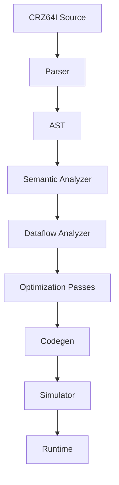

# CRZ64I Documentation

## Overview

CRZ64I is a custom instruction set architecture (ISA) designed for high-performance computing with energy and thermal awareness. This Python implementation provides a complete compiler, simulator, and runtime environment for CRZ64I programs.

## Architecture

## Key Features

- **Attributes**: #[fusion], #[reversible], #[no_erase], #[power="low"], #[realtime], #[thermal_hint]
- **Instructions**: ADD, LOAD, STORE, VADD, FMA, etc.
- **Energy Modeling**: Per-operation energy coefficients
- **Thermal Simulation**: Passive cooling and hotspot tracking
- **Runtime Hints**: Power and thermal-aware scheduling

## Getting Started

See [README.md](../README.md) for installation and usage.

## Language Reference

See [language.md](language.md) for the CRZ64I language specification.

## Compiler

See [compiler.md](compiler.md) for compiler internals.

## Simulator

See [simulator.md](simulator.md) for simulation details.

## Contributing

See [contrib.md](contrib.md) for development guidelines.
